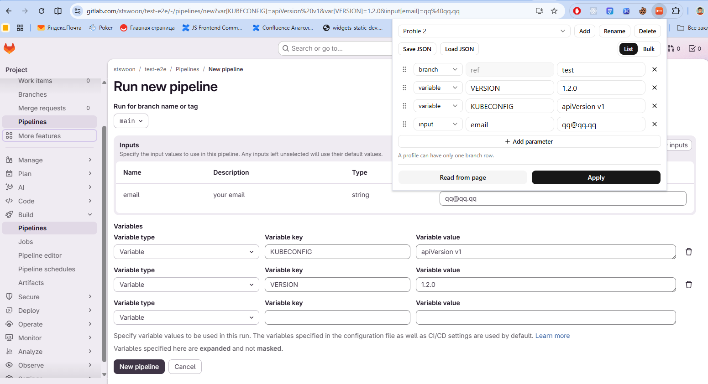

# GitLab Pipeline Helper

Chrome extension that prefills the GitLab **New pipeline** page from URL query params, and lets you save reusable profiles.

On `…/-/pipelines/new` it fills:

- **Branch or tag** from `ref`
- **CI/CD variables** from `var[NAME]`
- **Pipeline inputs** from `input[NAME]` (including dropdowns) — GitLab does not support this in the URL natively

Open the popup to create profiles, apply them to the current repo, read values already set on the page, or edit params as a query string.

> Info how to create chrome plugin see in https://blog.stswoon.ru/pages/2026/Hello%20World%20Chrome%20Plugin/index.html

