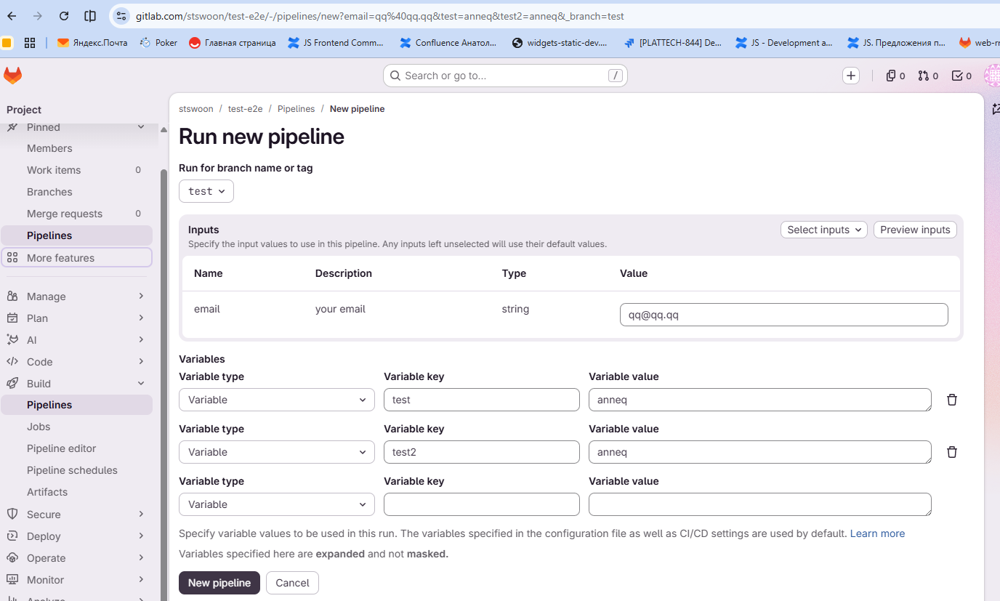

# GitLab Pipeline Prefill

Chrome extension (Manifest V3) that prefills GitLab’s **Run new pipeline** form from saved profiles or a query string.
It never clicks **Run pipeline**, **Cancel**, **Select inputs**, or **Preview inputs**.

## Build and load unpacked

```bash
npm install
npm test
npm run build
```

In Chrome: open `chrome://extensions`, enable **Developer mode**, choose **Load unpacked**, and select the `dist/`
folder.

## Query syntax

Apply navigates the active tab to `/-/pipelines/new` with profile values as query parameters:

- `_branch` — branch or tag for **Run for branch name or tag** (other keys starting with `_` are reserved and skipped).
- Comma-separated values fill multi-select inputs.
- `true` / `false` (case-insensitive) fill boolean inputs.

## Privacy

Profile values are stored **unencrypted** in `chrome.storage.local`. Apply puts every value in the page URL, so they
appear in browser history, the omnibox, and GitLab or proxy access logs. Do not store secrets in profiles.

## Verification

Automated tests use static DOM fixtures; they do not hit gitlab.com.

Unpacked Chrome loading and an authenticated pass on `/-/pipelines/new?...` (spec §10.2) were **not** run in this repo’s
automation. After `npm run build`, load `dist/` unpacked and run one real fill on your GitLab instance.


---



---

Agent workflow notes:

1. Agent Mode = Multitask
2. `/brainstorming @TASK.md`
3. `/subagent-driven-development @TASK.md @2026-09-05-gitlab-pipeline-chrome-plugin.md`


