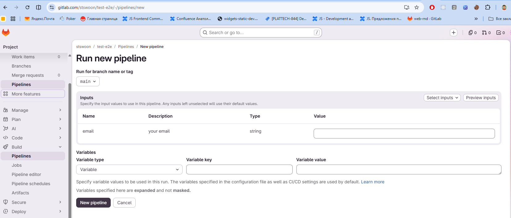
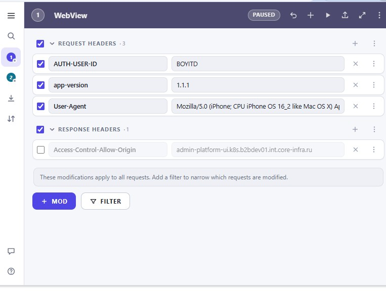

Создать Chrome Plugin для Gitlab Pipelines

## Часть 1

Chrome Plugin должен:
1) При матче в урле gitlab***/-/pipelines/new и наличие в нем квери параметров активируется плагин
2) если есть квери параметр с именем _branch, то используется для переключения Run for branch name or tag (после переключения нужно подождать загрузки variables и inputs)
3) плагин берет query параметры &a=1&b=2&c=3 и ищет наличие в inputs и подставлет значения 
4) те квери параметры который не нашлись в inputs ищутся в предзаполненых параметрах в variables
5) те квери параметры которые не удалось проставить для них создаются новые variables и проставляются значения
6) что что в gitlab pipelines параметры могут быть не только строковые но еще и листовые

Пример пайплайна на рисунке ниже

## Часть 2

Пользователь может настроить Chrome Plugin
1) можно создавать несколько профайлов, именовать, удалять
2) при нажатии apply система берет урл до `/-/` и навигирует на `<repo>/-/pipelines/new` и подставляет квери параметры из профиля, а затем уже отрабатывает оснвная логика из "часть 1"
3) профиль состоит из строчек каждая сточка имеет названание параметра и его значение, которое может задавать пользователь
4) можно переключать view профиля на балк где параметры можно заполнить в query формате `?_branch=main&a=1&b=2&c=3`

